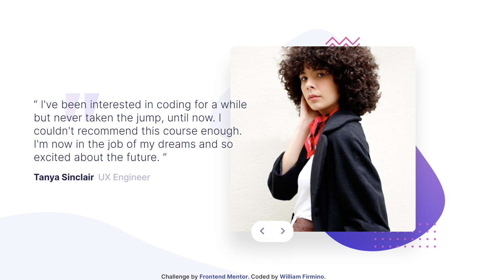
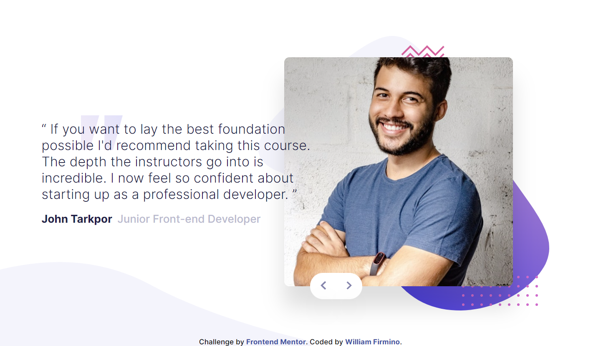
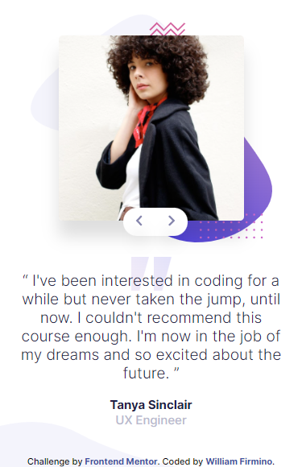
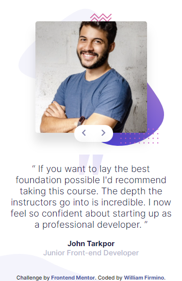

# Frontend Mentor - Coding bootcamp testimonials slider solution

This is a solution to the [Coding bootcamp testimonials slider challenge on Frontend Mentor](https://www.frontendmentor.io/challenges/coding-bootcamp-testimonials-slider-4FNyLA8JL). Frontend Mentor challenges help you improve your coding skills by building realistic projects.

## Table of contents

- [Overview](#overview)
  - [The challenge](#the-challenge)
  - [Screenshots](#screenshots)
  - [Links](#links)
- [My process](#my-process)
  - [Built with](#built-with)
  - [What I learned](#what-i-learned)
  - [Continued development](#continued-development)
  - [Useful resources](#useful-resources)
- [Author](#author)

## Overview

### The challenge

Users should be able to:

- View the optimal layout for the component depending on their device's screen size
- Navigate the slider using either their mouse/trackpad or keyboard

### Screenshots

> Desktop Previews
>  

> Mobile Previews   >  

### Links

- Solution URL: [https://github.com/Willwf/coding-bootcamp-testimonials-slider](https://github.com/Willwf/coding-bootcamp-testimonials-slider)
- Live Site URL: [https://coding-bootcamp-testimonials-slider-nu-five.vercel.app/](https://coding-bootcamp-testimonials-slider-nu-five.vercel.app/)

## My process

### Built with

- Semantic HTML5 markup
- CSS custom properties
- Media Queries
- Flexbox
- Mobile-first workflow
- [React](https://reactjs.org/) - JS library
- [Sass](https://sass-lang.com/) - CSS preprocessor
- [Vite.js](https://vitejs.dev/) - Bundler JS

### What I learned

I used this one to learn a lot of new things that I wasn't used to. I chose something that I thought was simples so I didn't become stuck in something too hard and difficult. It was challenging enough and I was finally able to pratice some concepts, despite struggling with simples things like hooks on React. There are parts of the code that I spend too much time to finish just searching for a way to do. I know that there's a lot of things to improve, but I finally reached a point that I'm feeling satisfied.

I'm intrigued by something that I still couldn't figured it out. Why do I need to click twice on the slide buttons to change the slides? It must be something with the useState hook but I still haven't found an answer. But I will continue to search and when I learn I'll update here.  
<strong>[UPDATE!]</strong> After some research I understood better the hook useEffect and could use it to change the states of the component. This way I could prevent the necessity of having to click twice on the button to trigger the change.

### Continued development

I still struggle a lot with hooks on React, so i think I should focus on them to understand better. And I want to learn Styled-components too.

### Useful resources

- [Event Listeners in React Components](https://www.pluralsight.com/guides/event-listeners-in-react-components) - This helped me a lot on how to use useEffect and build the logic to capture the arrow keys so I could change the slides with the keyboard. It was everything very new to me, and I don't think that I fully understand it but I plan to study the topic better.

## Author

- Github - [William Firmino](https://github.com/Willwf)
- Frontend Mentor - [@Willwf](https://www.frontendmentor.io/profile/Willwf)
- Twitter - [@Williamwf](https://www.twitter.com/Williamwf)
- LinkedIn - [William Firmino](https://www.linkedin.com/in/williamfirmino/)
